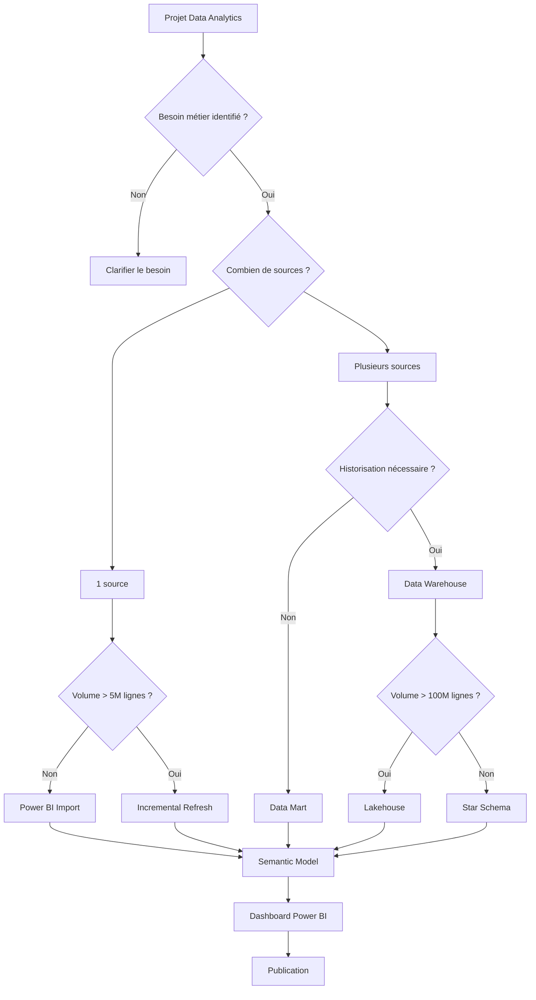

# Data Analytics Decision Tree

Arbre décisionnel permettant de choisir la meilleure architecture Data & BI.

## Vue globale

## Modules à développer

- Sources
- Volume
- Qualité des données
- Historisation
- Architecture
- Modélisation
- Performance
- Sécurité
- Gouvernance
