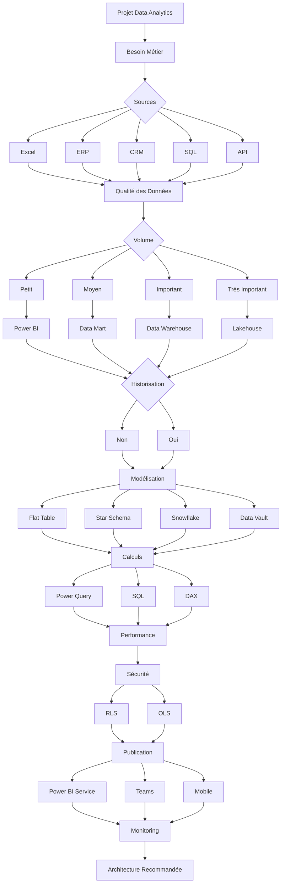

# 00 - Vue Globale

```mermaid
flowchart TD

A[Projet Data Analytics]

A --> B[Besoin Métier]

B --> C{Sources}

C --> C1[Excel]
C --> C2[ERP]
C --> C3[CRM]
C --> C4[SQL]
C --> C5[API]

C1 --> D[Qualité des Données]
C2 --> D
C3 --> D
C4 --> D
C5 --> D

D --> E{Volume}

E --> E1[Petit]
E --> E2[Moyen]
E --> E3[Important]
E --> E4[Très Important]

E1 --> F[Power BI]
E2 --> G[Data Mart]
E3 --> H[Data Warehouse]
E4 --> I[Lakehouse]

F --> J{Historisation}
G --> J
H --> J
I --> J

J --> J1[Non]
J --> J2[Oui]

J1 --> K[Modélisation]
J2 --> K

K --> K1[Flat Table]
K --> K2[Star Schema]
K --> K3[Snowflake]
K --> K4[Data Vault]

K1 --> L[Calculs]
K2 --> L
K3 --> L
K4 --> L

L --> L1[Power Query]
L --> L2[SQL]
L --> L3[DAX]

L1 --> M[Performance]
L2 --> M
L3 --> M

M --> N[Sécurité]

N --> N1[RLS]
N --> N2[OLS]

N1 --> O[Publication]
N2 --> O

O --> O1[Power BI Service]
O --> O2[Teams]
O --> O3[Mobile]

O1 --> P[Monitoring]
O2 --> P
O3 --> P

P --> Q[Architecture Recommandée]
```
``
