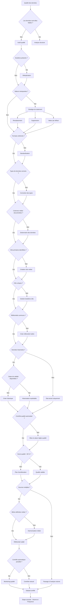

# 02 - Qualité des données

```mermaid
flowchart TD

A[Qualité des données]

A --> B{Les données sont-elles fiables ?}

B -- Non --> C[Audit qualité]
B -- Oui --> D[Analyse structure]

C --> E{Doublons présents ?}

E -- Oui --> F[Déduplication]
E -- Non --> G{Valeurs manquantes ?}

F --> G

G -- Oui --> H[Stratégie de traitement]
G -- Non --> I{Formats cohérents ?}

H --> H1[Remplacement]
H --> H2[Suppression]
H --> H3[Valeur par défaut]

H1 --> I
H2 --> I
H3 --> I

I -- Non --> J[Standardisation]

I -- Oui --> K{Types de données corrects ?}

J --> K

K -- Non --> L[Correction des types]

K -- Oui --> M{Colonnes métier documentées ?}

L --> M

M -- Non --> N[Dictionnaire des données]

M -- Oui --> O{Clés primaires identifiées ?}

N --> O

O -- Non --> P[Création clés métier]

O -- Oui --> Q{Clés uniques ?}

P --> Q

Q -- Non --> R[Gestion doublons clés]

Q -- Oui --> S{Référentiels communs ?}

R --> S

S -- Non --> T[Créer référentiel maître]

S -- Oui --> U{Données historisées ?}

T --> U

U -- Oui --> V{Dates de validité disponibles ?}

U -- Non --> W[Etat actuel uniquement]

V -- Non --> X[Créer historique]

V -- Oui --> Y[Historisation exploitable]

X --> Z{Contrôle qualité automatisé ?}

Y --> Z
W --> Z

Z -- Non --> AA[Mise en place règles qualité]

Z -- Oui --> AB{Score qualité > 90 % ?}

AA --> AB

AB -- Non --> AC[Plan d'amélioration]

AB -- Oui --> AD[Qualité validée]

AC --> AE{Sources multiples ?}

AD --> AE

AE -- Oui --> AF{Même définition métier ?}

AE -- Non --> AG[Passage à l'analyse volume]

AF -- Non --> AH[Harmonisation métier]

AF -- Oui --> AI[Référentiel validé]

AH --> AI

AI --> AJ{Contrôle automatique possible ?}

AJ -- Oui --> AK[Monitoring qualité]

AJ -- Non --> AL[Contrôle manuel]

AK --> AM[Dataset certifié]
AL --> AM

AG --> AM

AM --> AN[Etape suivante : Volume et Fréquence]
```
