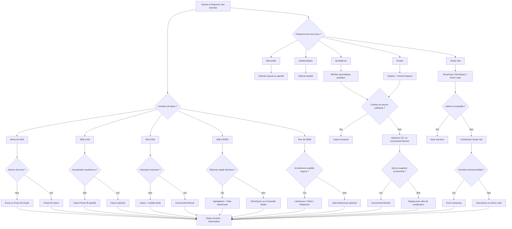

# 03 - Volume et fréquence

```mermaid
flowchart TD

A[Volume et fréquence des données]

A --> B{Combien de lignes ?}

B --> C[Moins de 500k]
B --> D[500k à 5M]
B --> E[5M à 50M]
B --> F[50M à 500M]
B --> G[Plus de 500M]

C --> H{Besoin récurrent ?}
H -- Non --> H1[Excel ou Power BI simple]
H -- Oui --> H2[Power BI Import]

D --> I{Actualisation quotidienne ?}
I -- Non --> I1[Import Power BI planifié]
I -- Oui --> I2[Import optimisé]

E --> J{Historique important ?}
J -- Non --> J1[Import + modèle étoile]
J -- Oui --> J2[Incremental Refresh]

F --> K{Réponse rapide attendue ?}
K -- Oui --> K1[Agrégations + Data Warehouse]
K -- Non --> K2[DirectQuery ou Composite Model]

G --> L{Architecture scalable requise ?}
L -- Oui --> L1[Lakehouse / Fabric / Databricks]
L -- Non --> L2[Data Warehouse optimisé]

A --> M{Fréquence de mise à jour ?}

M --> N[Mensuelle]
M --> O[Hebdomadaire]
M --> P[Quotidienne]
M --> Q[Horaire]
M --> R[Temps réel]

N --> N1[Refresh manuel ou planifié]
O --> O1[Refresh planifié]
P --> P1[Refresh automatique quotidien]
Q --> Q1[Pipeline + refresh fréquent]
R --> R1[Streaming / DirectQuery / Direct Lake]

P1 --> S{Fenêtre de refresh suffisante ?}
Q1 --> S
R1 --> T{Latence acceptable ?}

S -- Oui --> S1[Import conservé]
S -- Non --> S2[Optimiser ETL ou Incremental Refresh]

T -- Oui --> T1[Near real-time]
T -- Non --> T2[Architecture temps réel]

S2 --> U{Source supporte incrémental ?}
U -- Oui --> U1[Incremental Refresh]
U -- Non --> U2[Staging avec date de modification]

T2 --> V{Données événementielles ?}
V -- Oui --> V1[Event streaming]
V -- Non --> V2[DirectQuery ou Direct Lake]

U1 --> W[Etape suivante : Historisation]
U2 --> W
V1 --> W
V2 --> W
H1 --> W
H2 --> W
I1 --> W
I2 --> W
J1 --> W
J2 --> W
K1 --> W
K2 --> W
L1 --> W
L2 --> W
```
