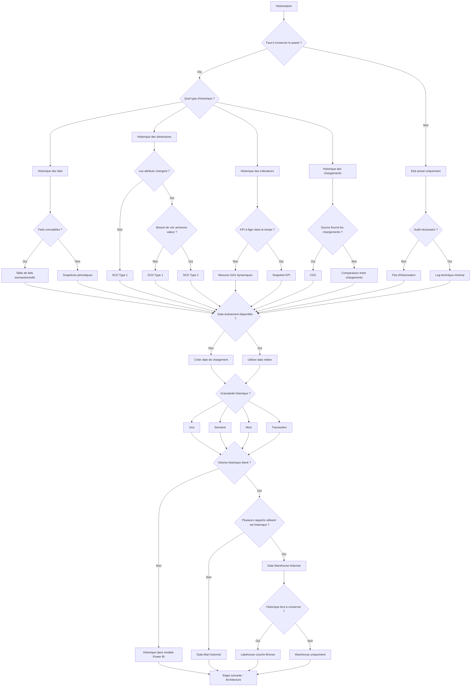

# 04 - Historisation

```mermaid
flowchart TD

A[Historisation]

A --> B{Faut-il conserver le passé ?}

B -- Non --> C[Etat actuel uniquement]
B -- Oui --> D{Quel type d'historique ?}

D --> E[Historique des faits]
D --> F[Historique des dimensions]
D --> G[Historique des indicateurs]
D --> H[Historique des changements]

E --> I{Faits cumulables ?}
I -- Oui --> I1[Table de faits transactionnelle]
I -- Non --> I2[Snapshots périodiques]

F --> J{Les attributs changent ?}
J -- Non --> J1[SCD Type 1]
J -- Oui --> J2{Besoin de voir ancienne valeur ?}

J2 -- Non --> J3[SCD Type 1]
J2 -- Oui --> J4[SCD Type 2]

G --> K{KPI à figer dans le temps ?}
K -- Non --> K1[Mesures DAX dynamiques]
K -- Oui --> K2[Snapshot KPI]

H --> L{Source fournit les changements ?}
L -- Oui --> L1[CDC]
L -- Non --> L2[Comparaison entre chargements]

C --> M{Audit nécessaire ?}
M -- Non --> M1[Pas d'historisation]
M -- Oui --> M2[Log technique minimal]

I1 --> N{Date événement disponible ?}
I2 --> N
J1 --> N
J3 --> N
J4 --> N
K1 --> N
K2 --> N
L1 --> N
L2 --> N
M1 --> N
M2 --> N

N -- Non --> O[Créer date de chargement]
N -- Oui --> P[Utiliser date métier]

O --> Q{Granularité historique ?}
P --> Q

Q --> R[Jour]
Q --> S[Semaine]
Q --> T[Mois]
Q --> U[Transaction]

R --> V{Volume historique élevé ?}
S --> V
T --> V
U --> V

V -- Non --> W[Historique dans modèle Power BI]
V -- Oui --> X{Plusieurs rapports utilisent cet historique ?}

X -- Non --> X1[Data Mart historisé]
X -- Oui --> X2[Data Warehouse historisé]

X2 --> Y{Historique brut à conserver ?}
Y -- Oui --> Y1[Lakehouse couche Bronze]
Y -- Non --> Y2[Warehouse uniquement]

W --> Z[Etape suivante : Architecture]
X1 --> Z
Y1 --> Z
Y2 --> Z
```
