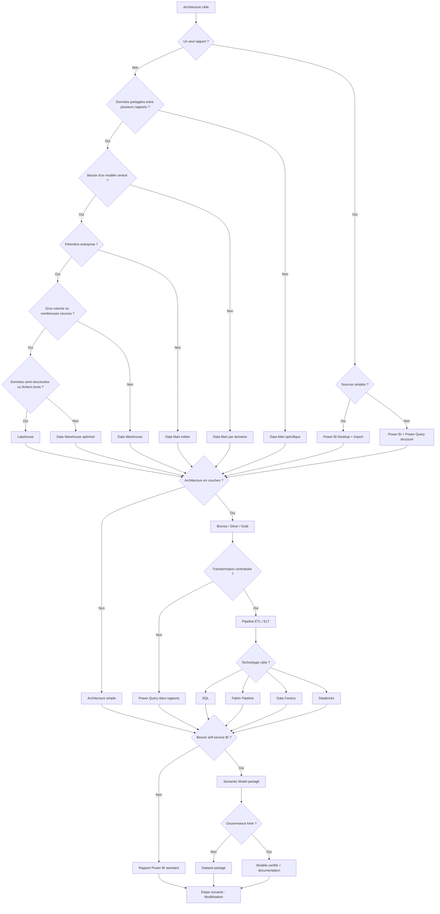

# 05 - Architecture cible

```mermaid
flowchart TD

A[Architecture cible]

A --> B{Un seul rapport ?}

B -- Oui --> C{Sources simples ?}
B -- Non --> D{Données partagées entre plusieurs rapports ?}

C -- Oui --> C1[Power BI Desktop + Import]
C -- Non --> C2[Power BI + Power Query structuré]

D -- Non --> D1[Data Mart spécifique]
D -- Oui --> E{Besoin d'un modèle central ?}

E -- Non --> E1[Data Mart par domaine]
E -- Oui --> F{Périmètre entreprise ?}

F -- Non --> F1[Data Mart métier]
F -- Oui --> G{Gros volume ou nombreuses sources ?}

G -- Non --> G1[Data Warehouse]
G -- Oui --> H{Données semi-structurées ou fichiers bruts ?}

H -- Oui --> H1[Lakehouse]
H -- Non --> H2[Data Warehouse optimisé]

H1 --> I{Architecture en couches ?}
H2 --> I
G1 --> I
F1 --> I
E1 --> I
D1 --> I
C1 --> I
C2 --> I

I -- Non --> I1[Architecture simple]
I -- Oui --> J[Bronze / Silver / Gold]

J --> K{Transformation centralisée ?}
K -- Non --> K1[Power Query dans rapports]
K -- Oui --> K2[Pipeline ETL / ELT]

K2 --> L{Technologie cible ?}
L --> L1[SQL]
L --> L2[Fabric Pipeline]
L --> L3[Data Factory]
L --> L4[Databricks]

I1 --> M{Besoin self-service BI ?}
K1 --> M
L1 --> M
L2 --> M
L3 --> M
L4 --> M

M -- Non --> M1[Rapport Power BI standard]
M -- Oui --> M2[Semantic Model partagé]

M2 --> N{Gouvernance forte ?}
N -- Non --> N1[Dataset partagé]
N -- Oui --> N2[Modèle certifié + documentation]

M1 --> O[Etape suivante : Modélisation]
N1 --> O
N2 --> O
```
