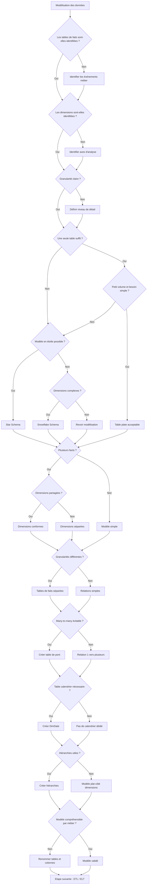

# 06 - Modélisation

```mermaid
flowchart TD

A[Modélisation des données]

A --> B{Les tables de faits sont-elles identifiées ?}

B -- Non --> B1[Identifier les événements métier]
B -- Oui --> C{Les dimensions sont-elles identifiées ?}

B1 --> C

C -- Non --> C1[Identifier axes d'analyse]
C -- Oui --> D{Granularité claire ?}

C1 --> D

D -- Non --> D1[Définir niveau de détail]
D -- Oui --> E{Une seule table suffit ?}

D1 --> E

E -- Oui --> F{Petit volume et besoin simple ?}
E -- Non --> G{Modèle en étoile possible ?}

F -- Oui --> F1[Table plate acceptable]
F -- Non --> G

G -- Oui --> G1[Star Schema]
G -- Non --> H{Dimensions complexes ?}

H -- Oui --> H1[Snowflake Schema]
H -- Non --> H2[Revoir modélisation]

G1 --> I{Plusieurs facts ?}
H1 --> I
H2 --> I
F1 --> I

I -- Non --> I1[Modèle simple]
I -- Oui --> J{Dimensions partagées ?}

J -- Non --> J1[Dimensions séparées]
J -- Oui --> J2[Dimensions conformes]

J2 --> K{Granularités différentes ?}
J1 --> K
I1 --> K

K -- Oui --> K1[Tables de faits séparées]
K -- Non --> K2[Relations simples]

K1 --> L{Many-to-many évitable ?}
K2 --> L

L -- Oui --> L1[Créer table de pont]
L -- Non --> L2[Relation 1 vers plusieurs]

L1 --> M{Table calendrier nécessaire ?}
L2 --> M

M -- Oui --> M1[Créer DimDate]
M -- Non --> M2[Pas de calendrier dédié]

M1 --> N{Hiérarchies utiles ?}
M2 --> N

N -- Oui --> N1[Créer hiérarchies]
N -- Non --> N2[Modèle plat côté dimensions]

N1 --> O{Modèle compréhensible par métier ?}
N2 --> O

O -- Non --> O1[Renommer tables et colonnes]
O -- Oui --> O2[Modèle validé]

O1 --> P[Etape suivante : ETL / ELT]
O2 --> P
```
