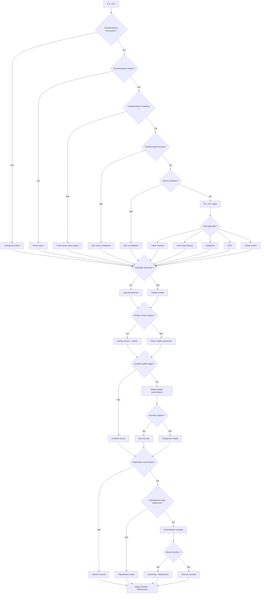

# 07 - ETL / ELT

```mermaid
flowchart TD

A[ETL / ELT]

A --> B{Transformations nécessaires ?}

B -- Non --> B1[Chargement direct]
B -- Oui --> C{Transformations simples ?}

C -- Oui --> C1[Power Query]
C -- Non --> D{Transformations réutilisées ?}

D -- Non --> D1[Power Query dans rapport]
D -- Oui --> E{Transformations lourdes ?}

E -- Non --> E1[SQL Views / Dataflows]
E -- Oui --> F{Volume important ?}

F -- Non --> F1[SQL ou Dataflows]
F -- Oui --> F2[ETL / ELT dédié]

F2 --> G{Outil disponible ?}
G --> G1[Fabric Pipeline]
G --> G2[Azure Data Factory]
G --> G3[Databricks]
G --> G4[SSIS]
G --> G5[Scripts Python]

B1 --> H{Traçabilité nécessaire ?}
C1 --> H
D1 --> H
E1 --> H
F1 --> H
G1 --> H
G2 --> H
G3 --> H
G4 --> H
G5 --> H

H -- Non --> H1[Pipeline simple]
H -- Oui --> I[Logs de traitement]

I --> J{Gestion erreurs requise ?}
H1 --> J

J -- Non --> J1[Erreur visible uniquement]
J -- Oui --> K[Gestion erreurs + alertes]

K --> L{Contrôle qualité intégré ?}
J1 --> L

L -- Non --> L1[Contrôle manuel]
L -- Oui --> L2[Règles qualité automatiques]

L2 --> M{Données rejetées ?}
M -- Oui --> M1[Zone de rejet]
M -- Non --> M2[Chargement validé]

L1 --> N{Planification automatique ?}
M1 --> N
M2 --> N

N -- Non --> N1[Refresh manuel]
N -- Oui --> O{Dépendances entre traitements ?}

O -- Non --> O1[Planification simple]
O -- Oui --> O2[Orchestration complète]

O2 --> P{Besoin DevOps ?}
P -- Oui --> P1[Versioning + déploiement]
P -- Non --> P2[Gestion manuelle]

N1 --> Q[Etape suivante : Performance]
O1 --> Q
P1 --> Q
P2 --> Q
```
