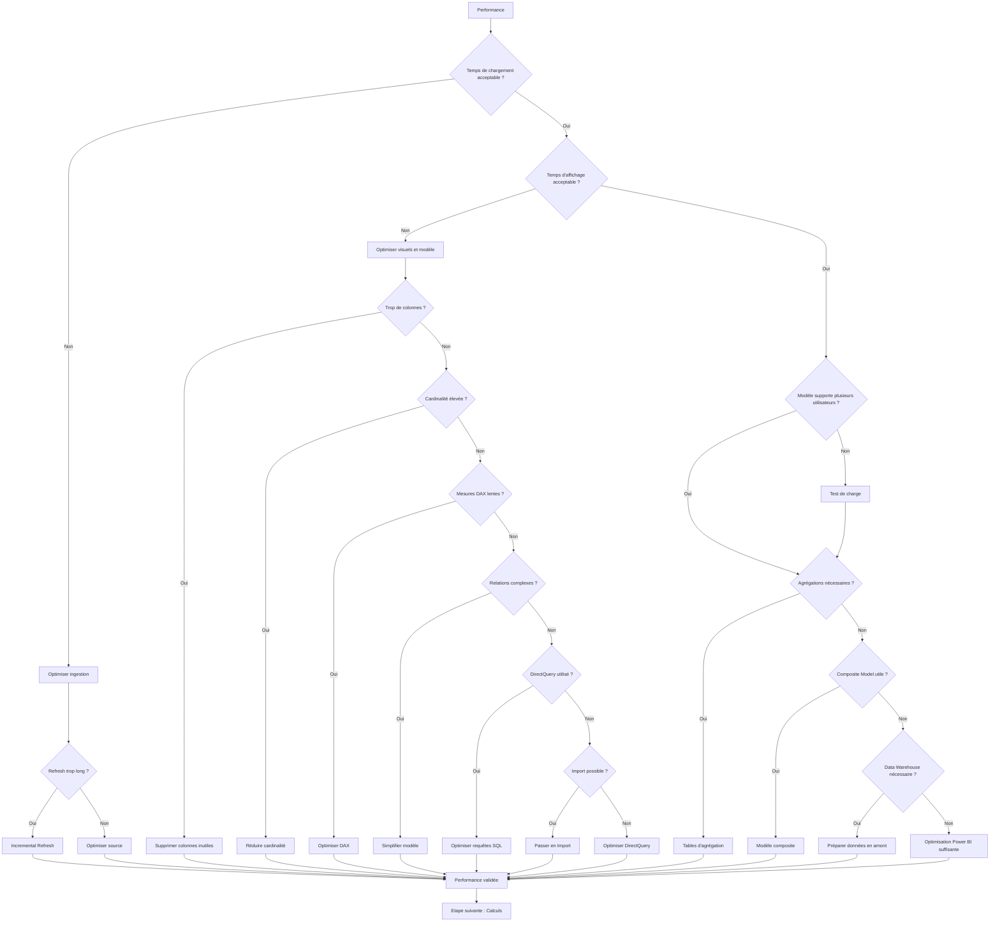

# 08 - Performance

```mermaid
flowchart TD

A[Performance]

A --> B{Temps de chargement acceptable ?}

B -- Oui --> C{Temps d'affichage acceptable ?}
B -- Non --> B1[Optimiser ingestion]

B1 --> B2{Refresh trop long ?}
B2 -- Oui --> B3[Incremental Refresh]
B2 -- Non --> B4[Optimiser source]

C -- Oui --> D{Modèle supporte plusieurs utilisateurs ?}
C -- Non --> C1[Optimiser visuels et modèle]

C1 --> E{Trop de colonnes ?}
E -- Oui --> E1[Supprimer colonnes inutiles]
E -- Non --> F{Cardinalité élevée ?}

F -- Oui --> F1[Réduire cardinalité]
F -- Non --> G{Mesures DAX lentes ?}

G -- Oui --> G1[Optimiser DAX]
G -- Non --> H{Relations complexes ?}

H -- Oui --> H1[Simplifier modèle]
H -- Non --> I{DirectQuery utilisé ?}

I -- Oui --> I1[Optimiser requêtes SQL]
I -- Non --> J{Import possible ?}

J -- Oui --> J1[Passer en Import]
J -- Non --> J2[Optimiser DirectQuery]

D -- Non --> K[Test de charge]
D -- Oui --> L{Agrégations nécessaires ?}

K --> L

L -- Oui --> L1[Tables d'agrégation]
L -- Non --> M{Composite Model utile ?}

M -- Oui --> M1[Modèle composite]
M -- Non --> N{Data Warehouse nécessaire ?}

N -- Oui --> N1[Préparer données en amont]
N -- Non --> N2[Optimisation Power BI suffisante]

B3 --> O[Performance validée]
B4 --> O
E1 --> O
F1 --> O
G1 --> O
H1 --> O
I1 --> O
J1 --> O
J2 --> O
L1 --> O
M1 --> O
N1 --> O
N2 --> O

O --> P[Etape suivante : Calculs]
```
