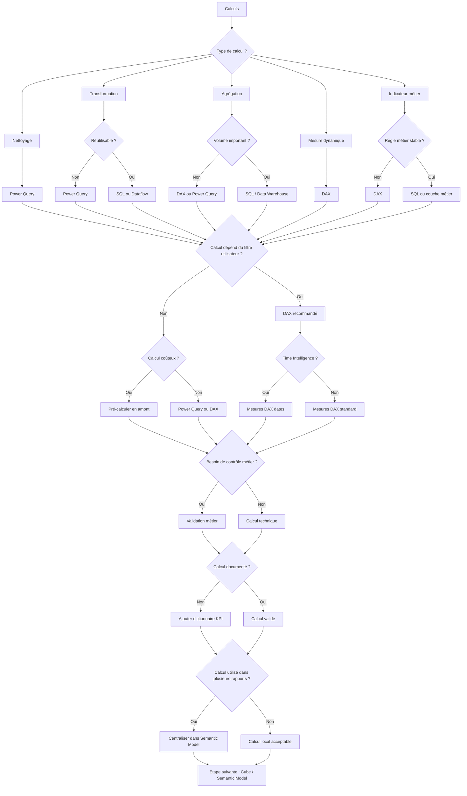

# 09 - Calculs SQL / Power Query / DAX

```mermaid
flowchart TD

A[Calculs]

A --> B{Type de calcul ?}

B --> C[Nettoyage]
B --> D[Transformation]
B --> E[Agrégation]
B --> F[Mesure dynamique]
B --> G[Indicateur métier]

C --> C1[Power Query]
D --> D1{Réutilisable ?}
E --> E1{Volume important ?}
F --> F1[DAX]
G --> G1{Règle métier stable ?}

D1 -- Non --> D2[Power Query]
D1 -- Oui --> D3[SQL ou Dataflow]

E1 -- Non --> E2[DAX ou Power Query]
E1 -- Oui --> E3[SQL / Data Warehouse]

G1 -- Non --> G2[DAX]
G1 -- Oui --> G3[SQL ou couche métier]

C1 --> H{Calcul dépend du filtre utilisateur ?}
D2 --> H
D3 --> H
E2 --> H
E3 --> H
F1 --> H
G2 --> H
G3 --> H

H -- Oui --> I[DAX recommandé]
H -- Non --> J{Calcul coûteux ?}

J -- Oui --> K[Pré-calculer en amont]
J -- Non --> L[Power Query ou DAX]

I --> M{Time Intelligence ?}
M -- Oui --> M1[Mesures DAX dates]
M -- Non --> M2[Mesures DAX standard]

K --> N{Besoin de contrôle métier ?}
L --> N
M1 --> N
M2 --> N

N -- Non --> N1[Calcul technique]
N -- Oui --> O[Validation métier]

O --> P{Calcul documenté ?}
N1 --> P

P -- Non --> P1[Ajouter dictionnaire KPI]
P -- Oui --> P2[Calcul validé]

P1 --> Q{Calcul utilisé dans plusieurs rapports ?}
P2 --> Q

Q -- Oui --> Q1[Centraliser dans Semantic Model]
Q -- Non --> Q2[Calcul local acceptable]

Q1 --> R[Etape suivante : Cube / Semantic Model]
Q2 --> R
```
