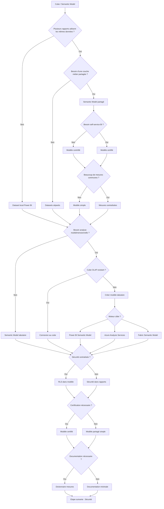

# 10 - Cube et Semantic Model

```mermaid
flowchart TD

A[Cube / Semantic Model]

A --> B{Plusieurs rapports utilisent les mêmes données ?}

B -- Non --> C[Dataset local Power BI]
B -- Oui --> D{Besoin d'une couche métier partagée ?}

D -- Non --> D1[Datasets séparés]
D -- Oui --> E[Semantic Model partagé]

E --> F{Besoin self-service BI ?}
F -- Non --> F1[Modèle contrôlé]
F -- Oui --> F2[Modèle certifié]

F1 --> G{Beaucoup de mesures communes ?}
F2 --> G

G -- Non --> G1[Modèle simple]
G -- Oui --> G2[Mesures centralisées]

G2 --> H{Besoin analyse multidimensionnelle ?}
G1 --> H
C --> H
D1 --> H

H -- Non --> I[Semantic Model tabulaire]
H -- Oui --> J{Cube OLAP existant ?}

J -- Oui --> J1[Connexion au cube]
J -- Non --> J2[Créer modèle tabulaire]

J2 --> K{Moteur cible ?}
K --> K1[Power BI Semantic Model]
K --> K2[Azure Analysis Services]
K --> K3[Fabric Semantic Model]

I --> L{Sécurité centralisée ?}
J1 --> L
K1 --> L
K2 --> L
K3 --> L

L -- Oui --> L1[RLS dans modèle]
L -- Non --> L2[Sécurité dans rapports]

L1 --> M{Certification nécessaire ?}
L2 --> M

M -- Oui --> M1[Modèle certifié]
M -- Non --> M2[Modèle partagé simple]

M1 --> N{Documentation nécessaire ?}
M2 --> N

N -- Oui --> N1[Dictionnaire mesures]
N -- Non --> N2[Documentation minimale]

N1 --> O[Etape suivante : Sécurité]
N2 --> O
```
