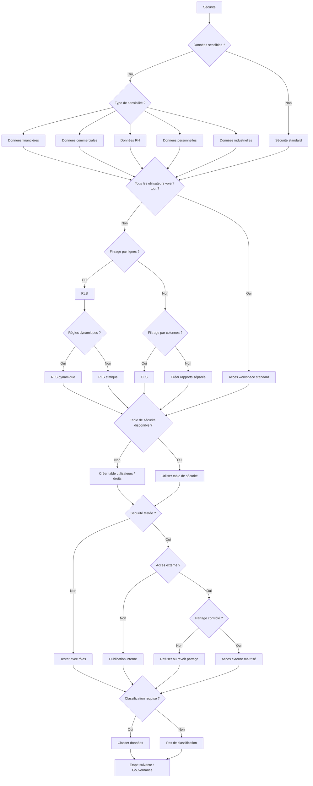

# 11 - Sécurité

```mermaid
flowchart TD

A[Sécurité]

A --> B{Données sensibles ?}

B -- Non --> C[Sécurité standard]
B -- Oui --> D{Type de sensibilité ?}

D --> E[Données financières]
D --> F[Données commerciales]
D --> G[Données RH]
D --> H[Données personnelles]
D --> I[Données industrielles]

E --> J{Tous les utilisateurs voient tout ?}
F --> J
G --> J
H --> J
I --> J
C --> J

J -- Oui --> J1[Accès workspace standard]
J -- Non --> K{Filtrage par lignes ?}

K -- Oui --> K1[RLS]
K -- Non --> L{Filtrage par colonnes ?}

L -- Oui --> L1[OLS]
L -- Non --> L2[Créer rapports séparés]

K1 --> M{Règles dynamiques ?}
M -- Oui --> M1[RLS dynamique]
M -- Non --> M2[RLS statique]

M1 --> N{Table de sécurité disponible ?}
M2 --> N
L1 --> N
L2 --> N
J1 --> N

N -- Non --> N1[Créer table utilisateurs / droits]
N -- Oui --> N2[Utiliser table de sécurité]

N1 --> O{Sécurité testée ?}
N2 --> O

O -- Non --> O1[Tester avec rôles]
O -- Oui --> P{Accès externe ?}

P -- Non --> P1[Publication interne]
P -- Oui --> Q{Partage contrôlé ?}

Q -- Non --> Q1[Refuser ou revoir partage]
Q -- Oui --> Q2[Accès externe maîtrisé]

O1 --> R{Classification requise ?}
P1 --> R
Q1 --> R
Q2 --> R

R -- Oui --> R1[Classer données]
R -- Non --> R2[Pas de classification]

R1 --> S[Etape suivante : Gouvernance]
R2 --> S
```
