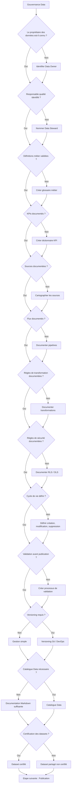

# 12 - Gouvernance

```mermaid
flowchart TD

A[Gouvernance Data]

A --> B{Le propriétaire des données est-il connu ?}

B -- Non --> B1[Identifier Data Owner]
B -- Oui --> C{Responsable qualité identifié ?}

B1 --> C

C -- Non --> C1[Nommer Data Steward]
C -- Oui --> D{Définitions métier validées ?}

C1 --> D

D -- Non --> D1[Créer glossaire métier]
D -- Oui --> E{KPIs documentés ?}

D1 --> E

E -- Non --> E1[Créer dictionnaire KPI]
E -- Oui --> F{Sources documentées ?}

E1 --> F

F -- Non --> F1[Cartographier les sources]
F -- Oui --> G{Flux documentés ?}

F1 --> G

G -- Non --> G1[Documenter pipelines]
G -- Oui --> H{Règles de transformation documentées ?}

G1 --> H

H -- Non --> H1[Documenter transformations]
H -- Oui --> I{Règles de sécurité documentées ?}

H1 --> I

I -- Non --> I1[Documenter RLS / OLS]
I -- Oui --> J{Cycle de vie défini ?}

I1 --> J

J -- Non --> J1[Définir création, modification, suppression]
J -- Oui --> K{Validation avant publication ?}

J1 --> K

K -- Non --> K1[Créer processus de validation]
K -- Oui --> L{Versioning requis ?}

K1 --> L

L -- Non --> L1[Gestion simple]
L -- Oui --> L2[Versioning Git / DevOps]

L1 --> M{Catalogue Data nécessaire ?}
L2 --> M

M -- Non --> M1[Documentation Markdown suffisante]
M -- Oui --> M2[Catalogue Data]

M1 --> N{Certification des datasets ?}
M2 --> N

N -- Oui --> N1[Dataset certifié]
N -- Non --> N2[Dataset partagé non certifié]

N1 --> O[Etape suivante : Publication]
N2 --> O
```
