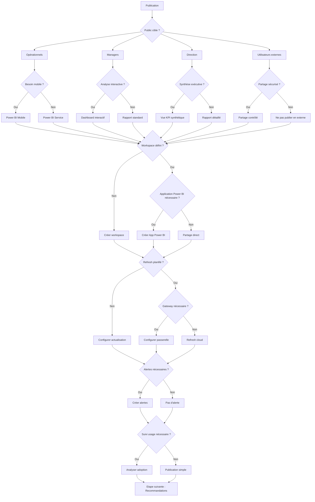

# 13 - Publication

```mermaid
flowchart TD

A[Publication]

A --> B{Public cible ?}

B --> C[Opérationnels]
B --> D[Managers]
B --> E[Direction]
B --> F[Utilisateurs externes]

C --> G{Besoin mobile ?}
D --> H{Analyse interactive ?}
E --> I{Synthèse exécutive ?}
F --> J{Partage sécurisé ?}

G -- Oui --> G1[Power BI Mobile]
G -- Non --> G2[Power BI Service]

H -- Oui --> H1[Dashboard interactif]
H -- Non --> H2[Rapport standard]

I -- Oui --> I1[Vue KPI synthétique]
I -- Non --> I2[Rapport détaillé]

J -- Oui --> J1[Partage contrôlé]
J -- Non --> J2[Ne pas publier en externe]

G1 --> K{Workspace défini ?}
G2 --> K
H1 --> K
H2 --> K
I1 --> K
I2 --> K
J1 --> K
J2 --> K

K -- Non --> K1[Créer workspace]
K -- Oui --> L{Application Power BI nécessaire ?}

L -- Oui --> L1[Créer App Power BI]
L -- Non --> L2[Partage direct]

K1 --> M{Refresh planifié ?}
L1 --> M
L2 --> M

M -- Non --> M1[Configurer actualisation]
M -- Oui --> N{Gateway nécessaire ?}

N -- Oui --> N1[Configurer passerelle]
N -- Non --> N2[Refresh cloud]

M1 --> O{Alertes nécessaires ?}
N1 --> O
N2 --> O

O -- Oui --> O1[Créer alertes]
O -- Non --> O2[Pas d'alerte]

O1 --> P{Suivi usage nécessaire ?}
O2 --> P

P -- Oui --> P1[Analyser adoption]
P -- Non --> P2[Publication simple]

P1 --> Q[Etape suivante : Recommandations]
P2 --> Q
```
