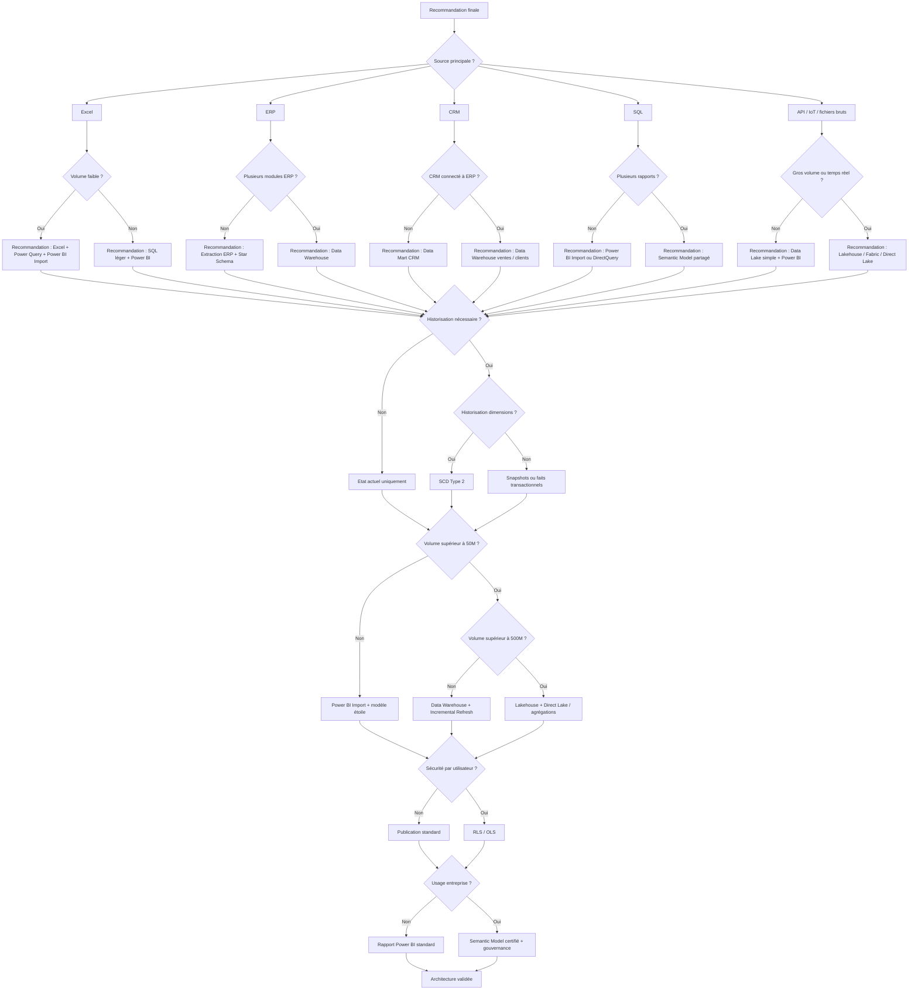

# 14 - Recommandations finales

```mermaid
flowchart TD

A[Recommandation finale]

A --> B{Source principale ?}

B --> C[Excel]
B --> D[ERP]
B --> E[CRM]
B --> F[SQL]
B --> G[API / IoT / fichiers bruts]

C --> H{Volume faible ?}
H -- Oui --> H1[Recommandation : Excel + Power Query + Power BI Import]
H -- Non --> H2[Recommandation : SQL léger + Power BI]

D --> I{Plusieurs modules ERP ?}
I -- Non --> I1[Recommandation : Extraction ERP + Star Schema]
I -- Oui --> I2[Recommandation : Data Warehouse]

E --> J{CRM connecté à ERP ?}
J -- Non --> J1[Recommandation : Data Mart CRM]
J -- Oui --> J2[Recommandation : Data Warehouse ventes / clients]

F --> K{Plusieurs rapports ?}
K -- Non --> K1[Recommandation : Power BI Import ou DirectQuery]
K -- Oui --> K2[Recommandation : Semantic Model partagé]

G --> L{Gros volume ou temps réel ?}
L -- Non --> L1[Recommandation : Data Lake simple + Power BI]
L -- Oui --> L2[Recommandation : Lakehouse / Fabric / Direct Lake]

H1 --> M{Historisation nécessaire ?}
H2 --> M
I1 --> M
I2 --> M
J1 --> M
J2 --> M
K1 --> M
K2 --> M
L1 --> M
L2 --> M

M -- Non --> N[Etat actuel uniquement]
M -- Oui --> O{Historisation dimensions ?}

O -- Oui --> O1[SCD Type 2]
O -- Non --> O2[Snapshots ou faits transactionnels]

N --> P{Volume supérieur à 50M ?}
O1 --> P
O2 --> P

P -- Non --> Q[Power BI Import + modèle étoile]
P -- Oui --> R{Volume supérieur à 500M ?}

R -- Non --> R1[Data Warehouse + Incremental Refresh]
R -- Oui --> R2[Lakehouse + Direct Lake / agrégations]

Q --> S{Sécurité par utilisateur ?}
R1 --> S
R2 --> S

S -- Non --> S1[Publication standard]
S -- Oui --> S2[RLS / OLS]

S1 --> T{Usage entreprise ?}
S2 --> T

T -- Non --> T1[Rapport Power BI standard]
T -- Oui --> T2[Semantic Model certifié + gouvernance]

T1 --> U[Architecture validée]
T2 --> U
```
