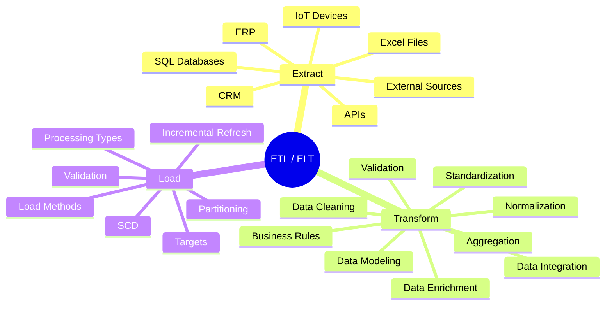

# ETL / ELT

## Description

L'ETL (Extract, Transform, Load) permet d'extraire les données depuis différentes sources, de les transformer afin de garantir leur qualité et leur cohérence, puis de les charger dans une plateforme analytique telle qu'un Data Warehouse ou un Lakehouse.

L'ELT (Extract, Load, Transform) suit la même logique mais réalise les transformations directement dans la plateforme cible.

### Extract
- ERP
- CRM
- SQL Databases
- Excel / CSV
- APIs
- IoT Devices
- Sources externes

### Transform
- Data Cleaning
- Standardization
- Normalization
- Data Integration
- Data Enrichment
- Business Rules
- Validation
- Aggregation
- Data Modeling

### Load
- Full Load
- Incremental Load
- CDC
- Delta Load
- Partitioning
- Incremental Refresh
- SCD
- Bronze / Silver / Gold
- Data Warehouse
- Lakehouse
- Semantic Model
